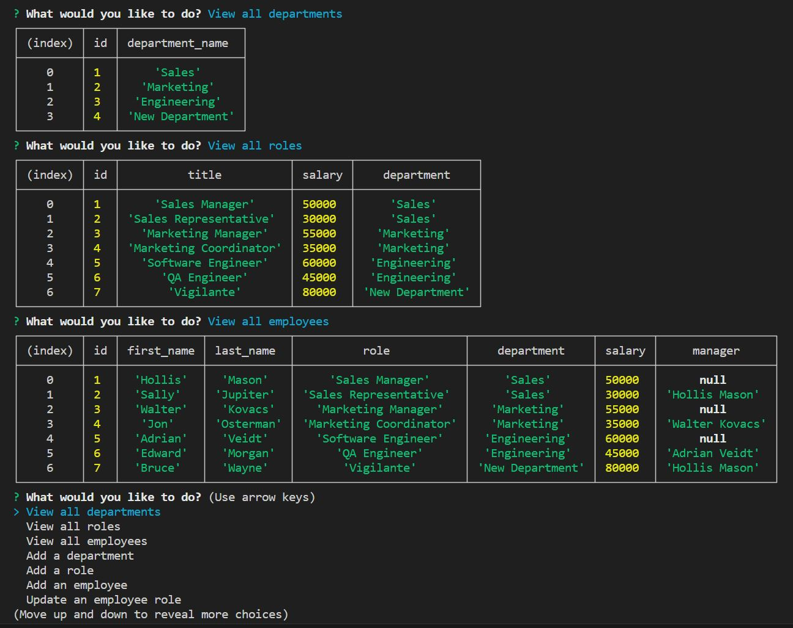

# Employee Tracker

## Description

Employee Tracker is a command-line application that allows you to manage departments, roles, and employees in a company. It provides a user-friendly interface to view, add, update from a MySQL database.

## Table of Contents

- [Installation](#installation)
- [Usage](#usage)
- [License](#license)
- [Contributing](#contributing)
- [Tests](#tests)
- [Questions](#questions)

## Installation

1. Clone the repository:

   git clone https://github.com/thorne7/LateBloomer

2. Navigate to the project's directory:

cd employee-tracker

3. Install the dependencies:
npm install

4. Set up your MySQL database by executing the SQL script provided in the db directory:
mysql -u your-username -p < db/schema.sql

5. Update the database connection details in the server.js file:

const connection = mysql.createConnection({
  host: 'localhost',
  user: 'your-username',
  password: 'your-password',
  database: 'your-database',
});

6. Start the application:

node server.js

## Usage
Follow the on-screen prompts to interact with the application. You can choose from various options such as viewing departments, roles, and employees, adding new entries, updating employee roles and managers, and more.

Make sure you have MySQL installed and running on your machine before using the application.

## License
This project is licensed under the MIT license.
